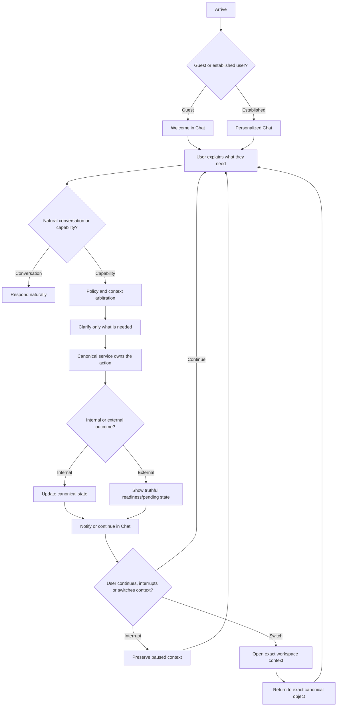

# Kurukoo Core Cross-Platform Journey Map

Kurukoo should feel like one continuous relationship even when the user moves between conversation, workspace surfaces, channels or devices. The journey map below is the shared product contract for PWA, iOS and Android.

## Core journey

## Journey stages

| Stage | User need | Shared behavior | PWA | iOS | Android |
|---|---|---|---|---|---|
| Arrival | Understand what Kurukoo is | Welcome as an agent, not a dashboard; ask for the user’s need naturally | Homepage or standalone Chat | Launch into Chat | Launch into Chat |
| First request | Say the need without knowing a category | Free-form composer, FastText/Brain arbitration, no forced card selection | Sticky composer | Keyboard-aware composer | IME-aware composer |
| Clarification | Supply missing destination, name, location or preference | One question at a time; preserve other active contexts | Inline message and optional quick reply | Inline message with sheet when structured input helps | Inline message with adaptive chips/sheet |
| Capability proposal | Decide whether to act | Show a calm proposal with exact next action and risk | Message action row | Confirmation sheet for high-risk actions | Confirmation dialog/sheet for high-risk actions |
| Execution | See what changed | Canonical service mutates; Chat reports state and evidence | Inline result and inspector update | Inline result plus native notification when configured | Inline result plus notification action when configured |
| Deferred work | Avoid waiting in a dead end | Create bounded goal, explain what is pending and how the user will be notified | Task/notification popover | Push continuation card | Notification action and task continuation |
| Interruption | Change topic without losing work | Pause current goal/context; do not let recency steal a later turn | Context inspector and recent conversation | Navigation stack and context sheet | Back stack and context sheet |
| Resumption | Return to the right thing | Exact object identity wins over semantic similarity | Resume action in Chat | Resume push/action sheet | Resume notification/action sheet |
| External boundary | Know whether something really happened | Distinguish prepared, accepted, pending, unavailable and verified | Readiness card | Native status sheet | Adaptive status sheet |
| Account/trust | Establish more access | Phone/email/device/channel evidence unlocks only supported capabilities | Auth flow preserves return context | Auth sheet preserves draft | Auth screen preserves draft |
| Memory | Control retained context | Review, revoke and explain provenance | Memory workspace | Native list/sheet | Adaptive list/sheet |

## Role journeys

The same shell serves different roles without fragmenting the product. A consumer starts with a need, a provider establishes capabilities and availability, a contributor sees attributable opportunities, a business manages offers and evidence, and an administrator manages readiness, content and policy. Role-specific controls appear only after identity and capability state justify them.

## Failure and recovery journeys

A failed or unavailable provider action returns the user to Chat with the exact canonical context preserved. The user can retry, choose another route, continue chatting or pause the request. A stale or foreign object fails closed and never substitutes a recent object. An offline device preserves drafts and displays the reconnect state; it does not claim external delivery.

## Cross-device continuation

The canonical conversation and object IDs are the continuity layer. PWA, iOS and Android may render different navigation primitives, but a notification, deep link or channel message always re-enters through the same conversation/object/action protocol. The user should be able to leave on one device and resume on another without losing the active context or receiving a duplicate mutation.
